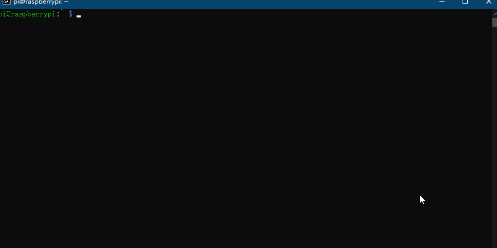

### 给树莓派的reaver增加i2c_lcd_1602显示的功能 ###

本人没有小型显示器,便在reaver上增加了把破解进度显示到lcd_1602的功能,便于破解邻居的wifi密码.

本人家里有wifi,仅以娱乐为目的.

改编自reaver-1.6.5 ( https://github.com/t6x/reaver-wps-fork-t6x 的不能运行,通过sudo apt source reaver获得源码)

# 安装

### 先决条件 ###

 - 请确保树莓派上有 wiringPi 

   安装 wiringPi : `sudo apt-get install wiringPi`
   
 - 请启动树莓派的 i2c 功能
   
   打开控制面板: `sudo raspi-config`
   
   按方向键调到 `Interface Options` 按回车
   
   按方向键调到 `I2C` 按回车
   
   在新的对话框上选择 `是` 回车
   
   
   
 - 得到自己的 i2c 硬件地址
   
   树莓派命令行中输入 `i2cdetect -y 1` (树莓派类型不同 代码最后的"1"也可能是"0"(`i2cdetect -y 0`))
   
   按输出的表 看看是不是在 (20,7) 上有信号
   
   
   
   如果你的也是(20,7),则不需要改 /main_i2c_lcd1602.c 里面的代码,否则,请参考 /main_i2c_lcd1602.c 中的 第7行注释,改掉"0x27" 这个字符
   
 - 接线
   
   | lcd1602 | 树莓派 |
   | --- | --- |
   | SDA | SDA.1 |
   | SCL | SCL.1 |
   | VCC | 随便找个5v的引脚 |
   | GND | 随便找个GND |
   
   
   
   
   
### reaver安装 ###
    
   克隆库 `git clone https://github.com/xmexg/reaver_raspberry_i2c-lcd-1602.git`
   
   进入src目录 `cd ./reaver_raspberry_i2c-lcd-1602/src`
   
   编译安装
   
   `./configure`
   
   `make`
   
   `sudo make install`
   
   结束
   
